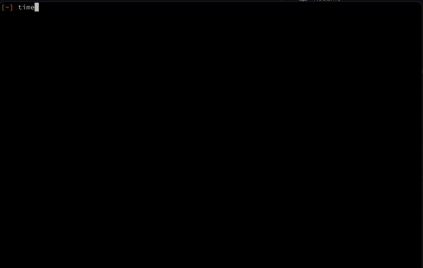

# paleofetch-bsd

A rewrite of [neofetch](https://github.com/dylanaraps/neofetch) in C started by [ss7m for linux](https://github.com/ss7m/paleofetch).

Not much code was left, but name is beautiful.

## Why use paleofetch over neofetch?

One major reason is the performance improvement.

At least for now paleofetch execution time is around 0.05s while neofetch will execute at least a second.

The plan is to support all BSDs(FreeBSD, NetBSD, OpenBSD, maybe Dragonfly), but for now only macOS.

## Dependencies

Having a Mac, or one of the BSDs, you could be very helpful.

## Compiling

`clang src/paleofetch.c -o paleofetch  -framework Cocoa -framework IOKit`

## FAQ

**Q**: Do you really run neofetch every time you open a terminal?  
**ss7m**: Yes, I like the way it looks and like that it causes my prompt to start midway
down the screen. I do acknowledge that the information it presents is not actually useful. 
**DB**: Yea, me too that's why I forked it.
