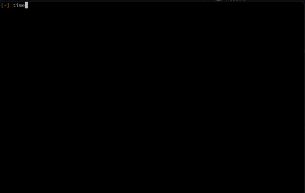

# paleofetch-bsd

A rewrite of [neofetch](https://github.com/dylanaraps/neofetch) in C started by [ss7m for linux](https://github.com/ss7m/paleofetch).

Not much code was left, but name is beautiful.
## IMPORTANT

As of today I no longer have intel mac, nor I can test it on BigSur as Monterey was dropped today and first problems arrise as Apple started to deprecate some stuff(name changes from Master to Main, thanks political correctness.). This doesn't work on M1 properly, which means when I'll fix it, there is a possibility that it won't work on intel.

## Why use paleofetch over neofetch?

One major reason is the performance improvement.

At least for now paleofetch execution time is around 0.05s while neofetch will execute at least a second.

The plan is to support all BSDs(FreeBSD, NetBSD, OpenBSD, maybe Dragonfly), but for now only macOS.

## Dependencies

Having a Mac, or one of the BSDs, you could be very helpful.

## Compiling

Enter folder and type `make file` or `make`

If you don't have it just type `clang src/paleofetch.c -o paleofetch  -framework Cocoa -framework IOKit`

There is also option `make clean` to clean and `make dump` to make assembly code for debuging

## FAQ

**Q**: Do you really run neofetch every time you open a terminal?  
**ss7m**: Yes, I like the way it looks and like that it causes my prompt to start midway
down the screen. I do acknowledge that the information it presents is not actually useful. 
**DB**: Yea, me too that's why I forked it.
