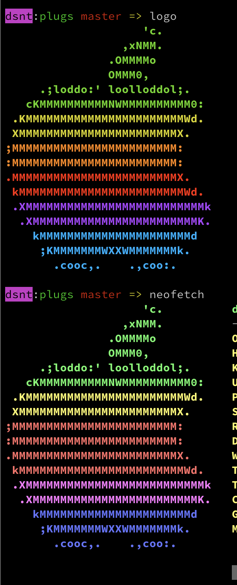
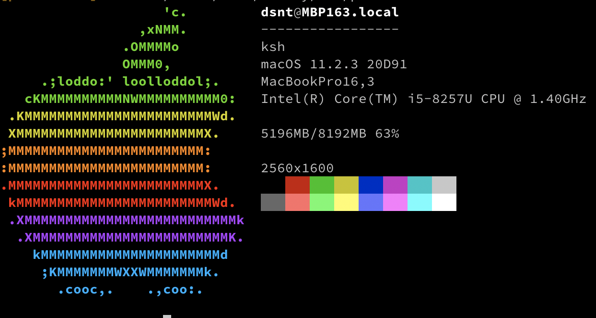

paleofetch-bsd
==============

A rewrite of [neofetch](https://github.com/dylanaraps/neofetch) in C started by [ss7m for linux](https://github.com/ss7m/paleofetch).

Not much code was left, but name is beautiful.

Currently showing only some info without logo.

Why use paleofetch over neofetch?
---------------------------------
One major reason is the performance possible improvement.

I used word possible as some commands like `system_profiler` are executed as console command, and then grepped which is really slow(.4s), and i will try to change that.

The plan is to support all BSDs(FreeBSD, NetBSD, OpenBSD, maybe Dragonfly) and macOS.

Also i would like to print logos in 256 colors instead of 16. That's why:

Example output:

Dependencies
------------
Having a Mac, or one of the BSDs, you could be very helpful.

Compiling
---------
For now i'm compiling single file, probably will configure `make` when i'll finish

FAQ
---

Q: Do you really run neofetch every time you open a terminal?  
ss7m: Yes, I like the way it looks and like that it causes my prompt to start midway
down the screen. I do acknowledge that the information it presents is not actually useful.
DB: Yea, me too that's why I forked it.
