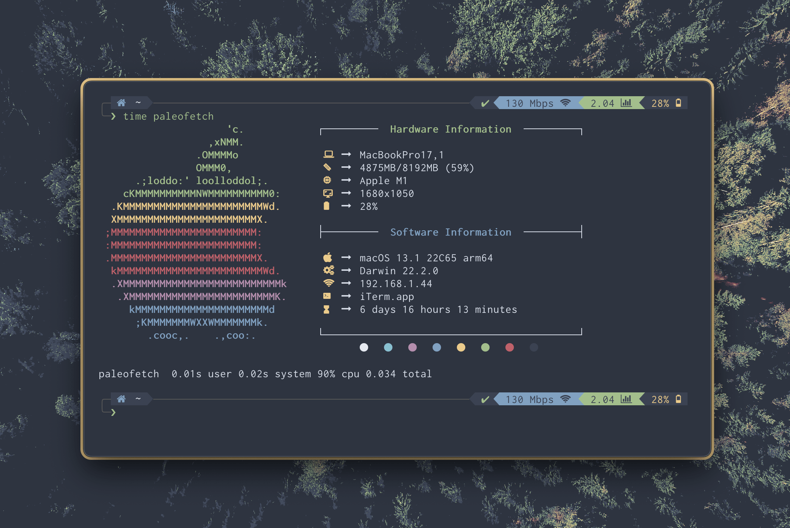

# paleofetch-mac-prettier :ribbon:

### This is a fork of [`paleofetch-mac`](https://gitlab.com/DesantBucie/paleofetch-mac)
> I have added some aesthetic changes to make it look like my old neofetch config

##### Few comments from the previous readme :newspaper:
_A rewrite of [neofetch](https://github.com/dylanaraps/neofetch) started by [ss7m for linux](https://github.com/ss7m/paleofetch).
Not much code was left, but the logic is similar._

### Why use paleofetch-mac-prettier over neofetch?
> It is fast, and aesthetic out of the box :zap:



## Installation instructions :wrench:
> It is mainly intended for mac you only need to have make installed pretty much

#### Requirements

- Install one of the [`Nerd Fonts`](https://github.com/ryanoasis/nerd-fonts) if you haven't already

##### Step by step instruction

1.  Cloning and moving into the directory
```bash
git clone https://github.com/Jac-Zac/paleofetch-mac-prettier.git && cd paleofetch-mac-prettier.
```
2.  Compiling and installing
```bash
make install
```

#### Recaching

Paleofetch uses caching to run faster. To recache data run `paleofetch -r`

----

#### IMPORTANT

This is developed on M1 arm64. It should work on x86_64, if not make an issue. No support for powerpc, but maybe will add it.
### FAQ

**Q**: Do you really run neofetch every time you open a terminal?

**ss7m**: Yes, I like the way it looks and like that it causes my prompt to start midway
down the screen. I do acknowledge that the information it presents is not actually useful.

**DB**: Yea, me too that's why I forked it.
